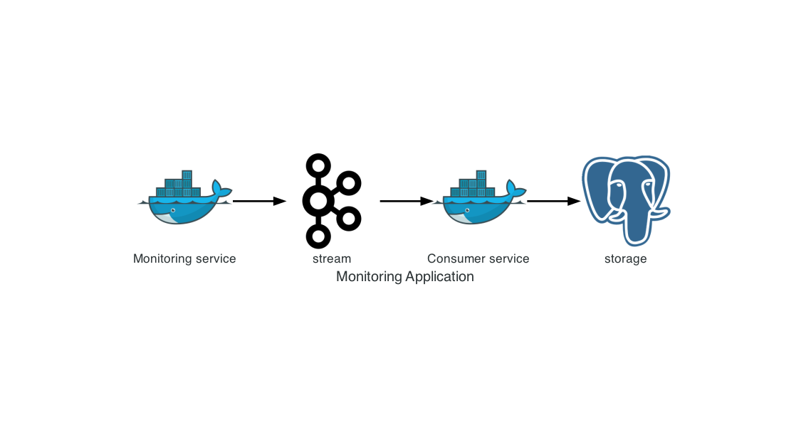

# Website Monitoring Application

This repository contains the source code for a simple monitoring application. The code
is written on Python and uses Asyncio.

## Application schema



## Application packages & project layout

The project uses the following packages:

- ``click`` - the command line framework
- ``loguru`` - the library for logging
- ``aiohttp`` - the asynchronous HTTP client
- ``aiokafka`` - the high-level, asynchronous library for workgin with kafka
- ``asyncpg`` - the database interface library designed specifically for PostgreSQL and
  Python/asyncio
- ``pytest`` - the test framework
- ``pytest-cov`` - the helper library for measuring the test coverage

Project layout:

```
.
├── LICENSE
├── README.md
├── compose
│   ├── local
│   └── production
├── consumer
│   ├── __init__.py
│   ├── consumer.py
│   ├── migrations
│   ├── serializer.py
│   └── tests
├── core
│   ├── __init__.py
│   ├── models.py
│   ├── tests
│   └── utils.py
├── local.yml
├── main.py
├── monitoring
│   ├── __init__.py
│   ├── monitors.py
│   ├── processor.py
│   ├── producer.py
│   ├── reader.py
│   ├── schema.py
│   ├── tests
│   └── writers.py
├── monitoring-sites.json
├── production.yml
├── requirements
│   ├── base.txt
│   └── local.txt
└── production.yml
```

## Usage

```
Usage: main.py [OPTIONS] COMMAND [ARGS]...

  Usage: ./main.py COMMAND [ARG...]

  Commands:
      monitoring   Start a monitoring service
          --source-file filepath to the source file
          --kafka_servers kafka bootstrap_servers
          --kafka_topic kafka topic
          --kafka_ssl_cafile CA certificate
          --kafka_ssl_certfile access certificate
          --kafka_ssl_keyfile access key
          --debug run application in the debug mode

      consumer Service for storing monitoring data
          --kafka_servers kafka bootstrap_servers
          --kafka_topic kafka topic
          --kafka_ssl_cafile CA certificate
          --kafka_ssl_certfile access certificate
          --kafka_ssl_keyfile access key
          --postgres_host PostgreSQL hostname
          --postgres_port PostgreSQL port
          --postgres_db PostgreSQL database
          --postgres_user PostgreSQL user
          --postgres_password PostgreSQL password
          --postgres_ssl use PostgreSQL ssl connection
          --debug run application in the debug mode

      init-migration runs an init migration
          --postgres_host PostgreSQL hostname
          --postgres_port PostgreSQL port
          --postgres_db PostgreSQL database
          --postgres_user PostgreSQL user
          --postgres_password PostgreSQL password
          --postgres_ssl use PostgreSQL ssl connection

  Example:
      >>> ./main.py monitoring --debug
      >>> ./main.py consumer --debug
      >>> ./main.py init-migration

Options:
  --help  Show this message and exit.

Commands:
  consumer        Service reads data from Kafka and writes to the database
  init-migration  runs init migration
  monitoring      Service checks sites and sends result to Kafka The input...
```

## Deployment

The following steps provide example how to deploy an application using Docker

### Prerequisites

* Docker 17.05+.
* Docker Compose 1.17+

### Understanding the Docker Compose Setup

Before you begin, check out the `production.yml` file in the root of this project. Keep
note of how it provides configuration for the following services:

    monitoring: the monitoring service monitors websites and writes results to Kafka;
    consumer: the consumer service reads results from Kafka and stores them to PostgreSQL.

Extra services for running application locally (`local.yml`):

    zookeeper running zookeeper;
    kafka running Kafka;
    postgres running PostgreSQL.

Running application locally:

      docker-compose -f local.yml up -d

For production environment you need to configure services through environment variables.
Create the `.env` with following settings:

```
POSTGRES_HOST=<pg_host>
POSTGRES_PORT=<pg_port>
POSTGRES_DB=<pg_database>
POSTGRES_USER=<pg_user>
POSTGRES_PASSWORD=<pg_password>
KAFKA_HOST=<kafka_host>
KAFKA_SSL_CAFILE=<kafka_ssl_cafile> # (optional)
KAFKA_SSL_CERTFILE=<kafka_ssl_certfile> # (optional)
KAFKA_SSL_KEYFILE=<kafka_ssl_keyfile> # (optional)
```

By default, PostgreSQL has used the SSL connection. If you need to disable it, remove
the `--postgres_ssl` parameter from the `compose/production/consumer` file

Running application:

      docker-compose -f production.yml up -d

## Testing

Running tests:

```
docker-compose run --rm  monitoring pytest --cov
```

Result

```
consumer/tests/test_serializer.py .                                                                                                                                                                                                                                                                              [  7%]
core/tests/test_json_encoder.py .                                                                                                                                                                                                                                                                                [ 14%]
core/tests/test_models.py .                                                                                                                                                                                                                                                                                      [ 21%]
monitoring/tests/test_json_reader.py ...                                                                                                                                                                                                                                                                         [ 42%]
monitoring/tests/test_monitors.py ......                                                                                                                                                                                                                                                                         [ 85%]
monitoring/tests/test_schema.py ..                                                                                                                                                                                                                                                                               [100%]

----------- coverage: platform linux, python 3.8.7-final-0 -----------
Name                                   Stmts   Miss  Cover
----------------------------------------------------------
consumer/__init__.py                       0      0   100%
consumer/serializer.py                    23      0   100%
consumer/tests/__init__.py                 0      0   100%
consumer/tests/test_serializer.py          9      0   100%
core/__init__.py                           0      0   100%
core/models.py                            23      1    96%
core/tests/__init__.py                     0      0   100%
core/tests/test_json_encoder.py            6      0   100%
core/tests/test_models.py                 11      0   100%
core/utils.py                             18      5    72%
monitoring/__init__.py                     0      0   100%
monitoring/monitors.py                    75      5    93%
monitoring/reader.py                      25      0   100%
monitoring/schema.py                      16      1    94%
monitoring/tests/__init__.py               0      0   100%
monitoring/tests/test_json_reader.py      28      0   100%
monitoring/tests/test_monitors.py         80      0   100%
monitoring/tests/test_schema.py           20      0   100%
----------------------------------------------------------
TOTAL                                    334     12    96%
```
